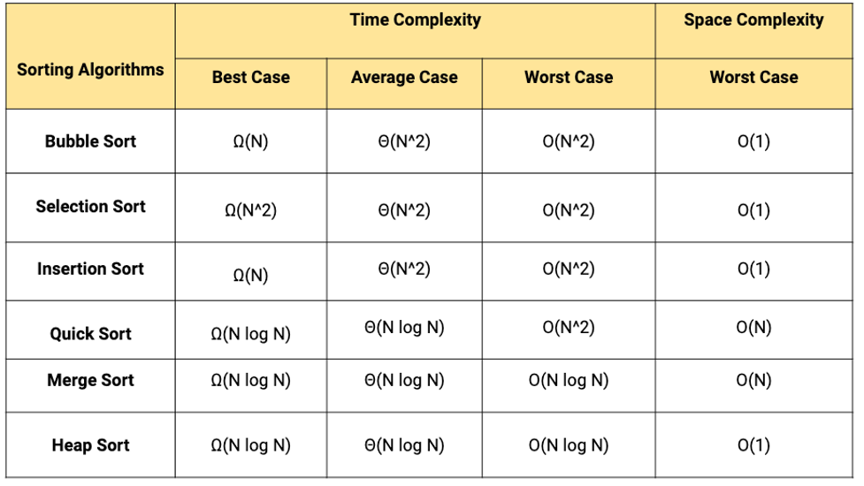

## Definicion
Es el proceso de predecir el *rendimiento* relativo de diferentes algoritmos para resolver un problema en función del *tamaño de la entrada*. Este enfoque incluye tanto el análisis teórico como el experimental para evaluar el rendimiento de los algoritmos.

## Tipos de Complejidad

- **Complejidad Espacial**: mide la cantidad de memoria que utiliza.
- **Complejidad Temporal**: se refiere a la cantidad de tiempo que un algoritmo tarda en ejecutarse en función del *tamaño de su entrada*. 
Se utiliza para medir cuánto *tiempo tardará* un algoritmo en ejecutarse en el peor de los casos o en promedio, en función del tamaño de la 
entrada.

## Medición del tiempo
- **Mejor de los casos**: Mejor tiempo de ejecución (Notacion Big-O)
- **Caso promedio**: Proporciona una predicción sobre el tiempo de ejecución (Notacion Theta)
- **Peor de los casos**: Peor tiempo de ejecución (Notacion Omega)

La notación Big-O se escribe así: $O(n \log n)$

Bloque completo:
$$
T(n) = O(n^2)
$$

## Notaciones Asintóticas

- $O(n)$: complejidad lineal
- $O(n \log n)$: complejidad log-lineal
- $O(n^2)$: complejidad cuadrática         