# Ejercicios de programacion

### Semana 5: Condicionales

**1. Calculadora**
Desarrolle un programa en C++ que solicite al usuario dos números y una operación a realizar entre ellos 
(suma, resta, multiplicación o división) y muestre el resultado. El programa debe ser capaz de realizar 
la operación indicada por el usuario y mostrar un mensaje de error si la operación no es válida.

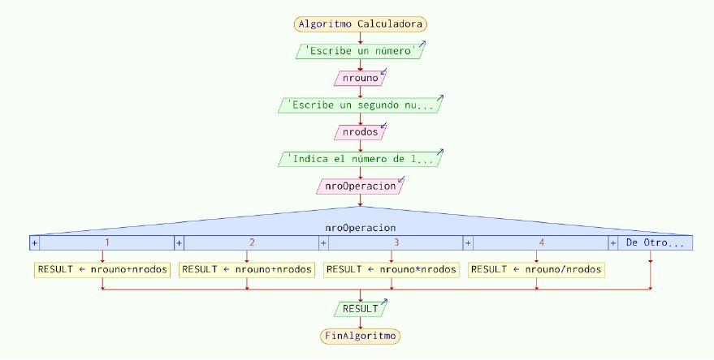

**2. Determinar el cuadrante en el plano cartesiano**
Desarrolle un programa en C++ que solicite al usuario las coordenadas de un punto en el plano cartesiano 
y determine en qué cuadrante se encuentra. El programa debe mostrar un mensaje indicando el cuadrante 
correspondiente o si el punto se encuentra en alguno de los ejes o en el origen.

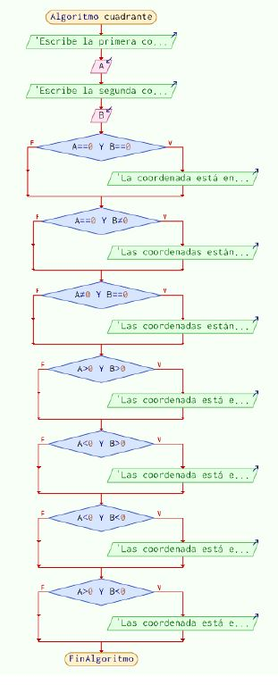 

**3. Calificación de examen**
Desarrolle un programa en C++ que solicite al usuario la calificación de un examen (0 a 100) y muestre si 
es insuficiente, suficiente, bien, notable o sobresaliente. El programa debe mostrar un mensaje indicando 
la calificación obtenida.

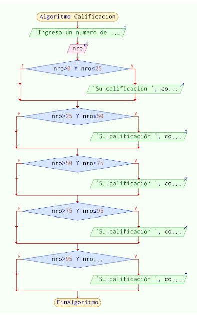

**4. Determinar el mayor de tres números**
Desarrolle un programa en C++ que solicite al usuario tres números 
y determine cuál de ellos es el mayor. El programa debe mostrar un mensaje indicando el número mayor.

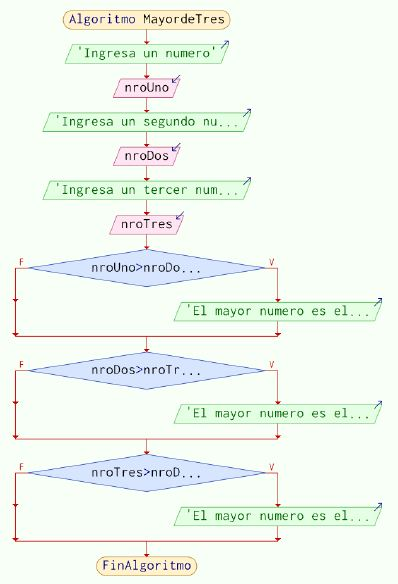

**5. Determinar si un año es bisiesto**
Desarrolle un programa en C++ que solicite al usuario un año y determine si es bisiesto o no. 
El programa debe mostrar un mensaje indicando si el año es bisiesto o no. Considere lo siguiente:
a.Todos los años bisiestos son divisibles entre 4.
b.Aquellos años que son divisibles entre 4, pero no entre 100, son bisiestos.
c.Los años que son divisibles entre 100, pero no entre 400, no son bisiestos.
d.Sin embargo, los años divisibles entre 100 y entre 400 sí que son bisiestos.

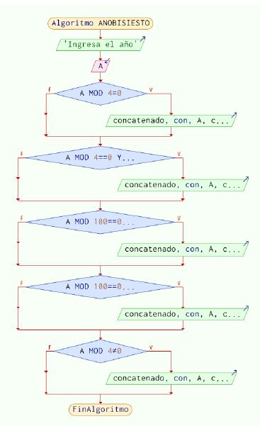

**6. Determinar el tipo de triángulo**
Desarrolle un programa en C++ que solicite al usuario la longitud de los tres lados de un triángulo y 
determine si es equilátero, isósceles o escaleno. El programa debe mostrar un mensaje indicando el tipo 
de triángulo.

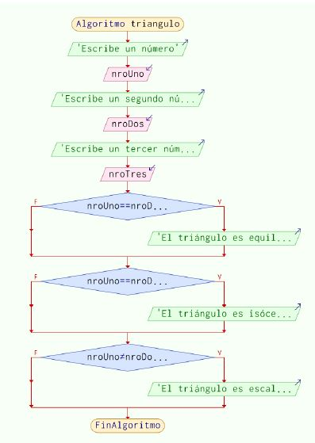

**7. Calcular el descuento**
Desarrolle un programa en C++ que solicite al usuario el precio de un producto y la cantidad de productos 
a comprar, y calcule el precio total aplicando un descuento del 10% si la cantidad es mayor a 10, o un descuento
del 20% si la cantidad es mayor a 20. El programa debe mostrar el precio total a pagar.

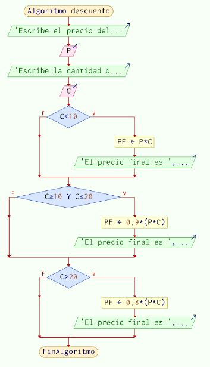

**8. Determinar si un número es par o impar**
Desarrolle un programa en C++ que solicite al usuario un número entero y determine si es par o impar. Si el 
número es cero, el programa debe indicar que es nulo. El programa debe mostrar un mensaje indicando si el número 
es par, impar o nulo.

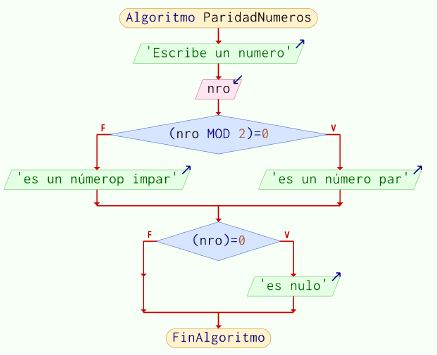

**9. Determinar el día de la semana**
Desarrolle un programa en C++ que solicite al usuario un número del 1 al 7 y muestre el día de la semana 
correspondiente. El programa debe mostrar un mensaje indicando el día de la semana o un mensaje de error si el 
número ingresado no es válido.

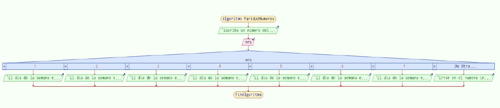

**10. Calcular el índice de masa corporal (IMC)**
Desarrolla un programa en C++ que solicite al usuario su peso (en kg) y su altura (en metros) y calcule su IMC. 
Luego, el programa debe mostrar si el usuario tiene bajo peso, peso normal, sobrepeso u obesidad 
(clase 1, clase 2, clase 3). El programa debe mostrar un mensaje indicando la categoría de IMC correspondiente. 
Considere lo siguiente:

• Bajo peso: IMC < 18.5
• Peso normal: 18.5 <= IMC < 24.9
• Sobrepeso: 25 <= IMC < 29.9
• Obesidad clase 1: 30 <= IMC < 34.9
• Obesidad clase 2: 35 <= IMC < 39.9
• Obesidad clase 3: IMC >= 40

### Semana 09: Bucles

**1. Obtener el MCD (máximo común divisor)** Dados dos números previamente validados, obtener el MCD (máximo común divisor), utilizando el método de 
factorización simultánea. Recuerde que el MCD es el mayor común divisor de todos ellos.

**2. Calcule la suma de la siguiente serie**

3. Desarrolle un algoritmo que calcule la suma de la siguiente serie hasta el numero entero positivo N ingresado.

4. Realizar un programa que calcule el resultado de la siguiente expresión:
1-2+3-4+5-6....n

5. Realice un programa que calcule y muestre en la salida entandar la suma de los cuadrados
de los cuadrados de los 10 primeros enteros mayores que cero, recuerde hacer las
validaciones necesarias.

6. En una clase de 5 alumnos, se han realizado tres exámenes y se requiere determinar el
número de:
a) Alumnos que aprobaron todos los exámenes
b) Alumnos que aprobaron al menos un examen.
c) Alumnos que aprobaron únicamente el último examen
Realice un programa que permita la lectura de los datos y el cálculo de las estadísticas.

7. Dado el éxito de su aplicación para poder predecir el nivel de endeudamiento, el Ministerio
de Economía en conjunto al INEI le han solicitado generar un grupo de estadísticas para
poder estimar el crecimiento poblacional. Para poder hacer los cálculos se reciben los
siguientes datos de las personas:
-Estado civil (S: Soltero, C: Casado, V: Viudo, D: Divorciado)
-Sexo (M: Masculino; F: Femenino)
-Sueldo (Valor numérico decimal mayor que 0)
-Tiene vivienda propia (S: Si, N: No)
Se le pide a usted un programa en C++ y en entorno consola, que solicite el ingreso de la
información de un conjunto de personas. El final será cuando se ingrese X como estado
civil de la persona luego de lo cual debe mostrar la siguiente información:
a) ¿Cuál es el porcentaje de personas, respecto del total, que tienen un sueldo mayor a 1500?
b) ¿Cuál es el promedio de sueldo de las mujeres que no tienen una vivienda propia?
c) ¿Cuál es el estado o estados civiles que es más frecuente?
d) ¿Cuál es el menor sueldo del varón que tiene casa propia y no es casado? En caso no
exista alguna persona mostrar un mensaje.

### Semana 11: Funciones con retorno

**1. Primer ejercicio**

Una fábrica paga a sus empleados según su condición, de modo que un obrero contratado recibe al mes S/. 1200.00 
y un obrero estable S/. 1000.00. así mismo, todos los empleados reciben un pago de gratificación en los meses de 
Julio y diciembre. Dicha gratificación varía de acuerdo con los años de servicios que tiene el empleado, como se 
muestra en el siguiente cuadro: 
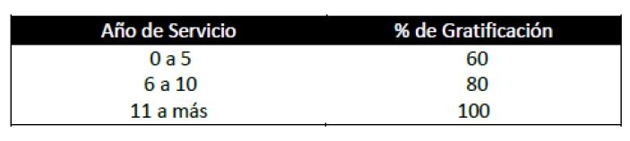
Mediante el uso de función con valor de retorno y la declaración de variables 
globales y locales correspondientes, realice lo siguiente:
- TipoObrero(). - Obtener el pago del obrero ya sea Contratado o Estable.
- CálculoSueldo(). - Calcular el sueldo de un obrero correspondiente a un mes determinado.

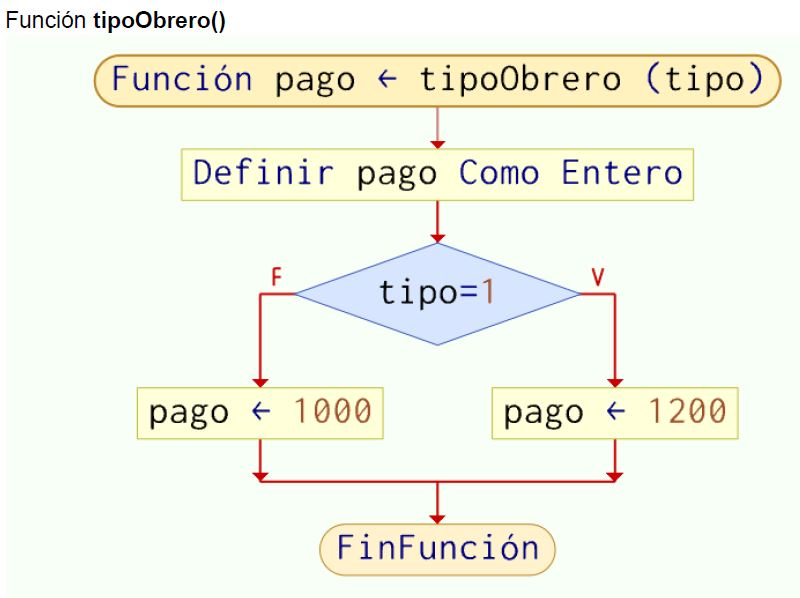

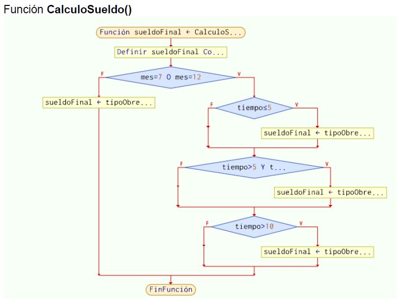

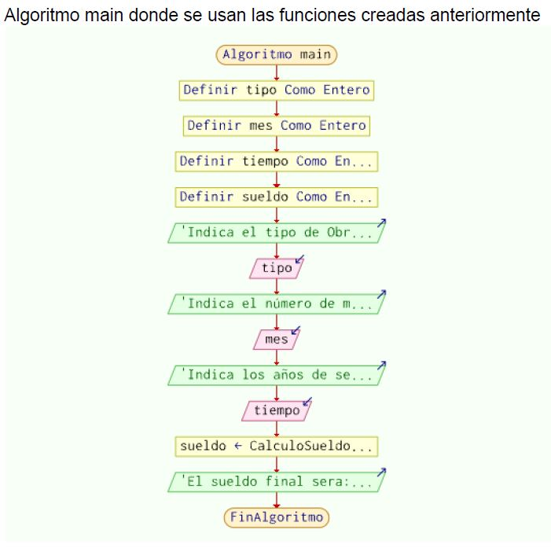

